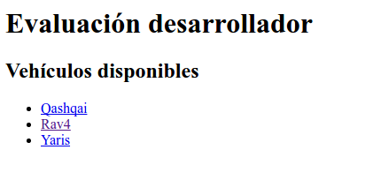
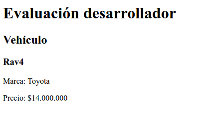

# evaluacion-programador
El presente proyecto simula una aplicación que permite listar y visualizar vehículos que se encuentran en una compraventa, los cuales tienen modelo, marca y precio.
## Configuración
- Archivo *parameters.yml.dist* contiene configuración inicial.

## Instrucciones
Se solicita realizar lo siguiente:

1. Crear un fork del repositorio en Github.
2. En la ruta `/autos/` listar **todos** los vehículos existentes en la aplicación.
  1. Crear Repository para obtener el listado.
  2. Utilizar el controlador `DefaultController.php` del bundle `CompraVentaBundle`.
3. Permitir a través de un link visualizar un vehículo en particular. Se debe mostrar en la ruta `/autos/{idDelVehiculo}`

## Resultado esperado
#### Listado de vehículos:
  

#### Despliegue de vehículo:
  
